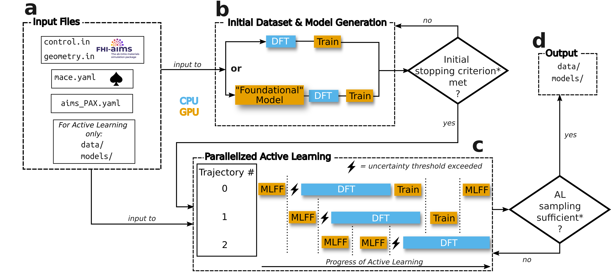

# Tutorial

## Installation 

The required libraries for aims PAX are:

1. ASE
2. numpy
3. asi4py
4. mace
5. pyTorch
6. pyYaml

Also, you have to compile FHI aims as a library (BUILD_SHARED_LIBS has to be set to ON in the CMake file).

If you want to use the automatic resource managment feature of aims PAX for computing multiple DFT runs in parallel you also need:

7. PARSL

For this you need to compile FHI AIMS as an executable (standard installation).


To install the dependencies you can clone the repository and run inside the directory:

```
pip install -r requirements.txt
```

!!! Note: Make sure to uncomment PARSL in requirements.txt if you want to use the PARSL version of aims PAX.

In order to install aims PAX itself, run:

```
pip install .
```


## Running 

To run aims PAX, one has to specify the settings for FHI aims, the MACE model and active learning. 

1. make sure the following files are in the working directory:
    - ```control.in```, 
    - ```geometry.in```,
    - ```mace_settings.yaml```,
    - ```active_learning_settings.yaml``` 
2. ```aims_PAX ``` (for example)

!!! Note: Running the parallel procedure on one node using the MPI implementation, you need to run the command using e.g. ```mpirun``` or ```srun```.

The settings are explained below and aims PAX automatically runs the all necessary steps. Both procedures, initial dataset acquisition and active learning, are classes that can be used independently from each other.

To only create an initial dataset you can run ```aims_PAX-initial-ds ``` in the terminal. Equivalently, to only run the active learning procedure (given that the previous step has been done or all the necessary files are present), just run ```aims_PAX-al```.

## The workflow 



We briefly explain the workflow that is performed automatically by aims PAX. For more details consult the publication (CITE).

The overall workflow of the procedure and some comments thereupon are written here. For more details on specific parameters take a look at the settings glossary at the bottom.

**Creating the initial ensemble and dataset.**

In the beginning a set of MACE models is trained on a initial dataset to serve as a starting point for the actual active learning. Each ensemble member gets their own initial training and validation set. See a) in the figure above.

For that, *ab initio* MD is run (one trajectory) using FHI AIMS and ASI/ASE. Alternatively, the *"foundational"* model MACE-MP0 is used to sample structures, which are subsequently recomputed using DFT. This is recommended as one ideally wants to have uncorrelated structures and MACE-MP0 is much cheaper to evaluate and gives reasonable structures. Also, when using PARSL, the calculations can be processed in parallel.
 
After a set number of samples  is collected the models are trained. Afterwards, new points are sampled and this loop is repeated until a desired level of accurcay (or a different criterion like max number of epochs etc.) of the ensemble on the validation datasets is reached.

The model parameters are kept and updated throughout, so they are not reinitialized when new points are added.

Optionally, the model(s) can be converged on the dataset. This means that the models are trained on the initial dataset until there is no improvement anymore. 


**Active Learning**

During the active learning procedure (c in the figure above), multiple MD trajectories are launched and run with the MLFF model(s). At a specified interval the uncertainty of the forces are computed. After a warmup (currently 10 uncertainty estimations) the moving average of the uncertainties is calculated. Using this the uncertainty threshold (with c~x) is computed. If the threshold is crossed during MD the DFT energies and forces are calculated for that point. The point is then added to the training or validation set.  

In the former case the MD is halted for the given trajectory and when the program loops back to it the models are trained for some epochs instead before continuing to the next trajectory. This state is kept until a maximum number of epochs is reached and the trajectory is propageted again.

In the serial version of aims PAX, the whole workflow halts when a DFT calculation is being run. In contrast, using the MPI version on a single node, the other trajectories can be propagated. In that case, once all trajectories have crossed the uncertainty threshold, the workflow is halted again and all DFT calculations are processed sequentially. When using the recommended PARSL version, all these DFT calculations can be processed in parallel depending on the available resources.


Similarly to the creation of the initial dataset, the models are updated throughout the whole process and are not reinitialized. As we are only adding a few points at a time this can lead to models getting stuck on a local minimum. If this happens, the optimizer state is reinitialized, which is supposed to kick the model out of the local minimum.

If the ```analysis``` keyword is set to ```True```, points from the MLFF MD are taken at fixed intervals and re-computed using FHI AIMS. The results and other metrics are saved in a dictionary. This can be used to track how the uncertainty behaves etc. As this results in many more DFT calculations it is generally not recommended for production runs.


<!---
**Atomic Energies**

```THIS IS NOT IMPLEMENTED PROPERLY, RIGHT NOW!!!```

It is recommended to use the isolated atomic energies of the elements in a given system as the *zero point* energy in MACE. This enables the model have the correct asymptotic behavior when dissocating molecules. The package includes a script that calculates the energies of all the elements found in a the ```geometry.in``` file. For this run ```aims_PAX-atomic-energies```. Make sure to have defined the path to aims, the species directory in the ```active_learning_settings.yaml``` and also that a ```control.in``` file is present. The results are saved in a log file. The energies can then be included in ```mace_settings.yaml```.
-->

## Settings 

### FHI aims settings 

The settings here are the same as for usual FHI aims calculations and are 
parsed internally in aims PAX. MD settings are not specified here.
Currently only one system and geometry can serve as an input (```geometry.in```).

As we are using ASE/ASI for running FHI aims, it is not needed to add the basis set information at the ned of the ```control.in``` file. That information is taken straight from the indicated species directory (see ```species_dir```) in the ```Active Learning Settings```.

### MACE settings 

The settings for the MACE model(s) are specified in the YAML file called 'mace_settings.yaml'. In the future, we'll use the settings stuff from the original mace code.
Inside the workflow, a dictionary is created with the 
following subdictionaries and keys:

- GENERAL:
    - **name_exp** *(str)*: This is the name given to the experiment and subsequently to the models and datasets.
    - **log_dir** *(str)*: Path to save the log files to.
    - **checkpoints_dir** *(str)*: Path to save the checkpoints from training to.
    - **results_dir** *(str)*: Path to save the training history to (see below).
    - **model_dir** *(str)*: Path to save the models to (see below).
    - **default_dtype** *(str)*: To specify whether to use float32 or float64 for the model.
    - **compute_stress** *(str)*: *Not implemented yet* 
    - **seed** *(int)*: Seed for RNG. Is used for batching and parameter initialization (or generating more seeds for ensembles)

- ARCHITECTURE:
    - **atomic_energies** *(dict)*: One can specify isolated atomic energies that will be used as E0s inside the model. If it's not specified, average values are computed from the data.
    - For the rest see official MACE documentation (the names are the same):
    *(model, r_max, num_channels, max_L, max_ell, radial_type, num_radial_basis, num_cutoff_basis, interaction, num_interactions, correlation, radial_MLP, gate, MLP_irreps, interaction_first, compute_avg_num_neighbors)*

- TRAINING:
    - See official MACE documentation (names are the same):
    *(valid_fraction, batch_size, valid_batch_size, weight_decay, scaling, lr, amsgrad, optimizer, scheduler, lr_scheduler_gamma, lr_factor, scheduler_patience, swa, ema, ema_decay, max_num_epochs, loss, energy_weight, forces_weight, virials_weight, stress_weight, config_type_weights, patience, clip_grad, eval_interval)*

- MISC:
    - See official MACE documentation (names are the same):
    *(device, keep_checkpoints, restart_latest, error_table, log_level)*

### Active Learning Settings 
- ACTIVE LEARNING
    - **desired_acc** *(float)*: Force MAE that the ensemble should reach on the validation set. 
    - **lambda** *Rename* *(float)*: lambda * desired_acc determines the Force MAE that the ensemble should reach on the validation set in the initial dataset collection phase.
    - **n_samples** *(int)*: Number of points that are sampled for each ensemble member using *ab initio* MD in the initial dataset collection phase before the models are trained.
    - **valid_ratio** *(float)*: Ratio of sampled points that is added to the validation set.
    - **converge_initial** *(bool)*: Whether to converge the model(s) on the initial dataset or not.
    - **converge_al** *(bool)*: Whether to converge the model(s) on the active learned dataset or not.
    - **converge_best** *(bool)*: Whether to pick the best performing model (force MAE on validation) from an ensemble and only converging this one.
    - **scheduler_initial** *(bool)*: Whether to use a learning rate scheduler when training the model(s) during the initial dataset collection phase.
    - **max_initial_epochs** *(int)*: Maximum numbers of epochs that are used when training the model(s) during the initial dataset collection phase.
    - **max_epochs_worker** *(int)*: Maximum number of epochs before the trajectory worker changes back to sampling instead of training mode.
    - **max_final_epochs** *(int)*: Maximum numbers of epochs when converging the model(s) on a dataset.
    - **intermediate_epochs** *(int)*: Number of epochs performed by a worker during the active learning phase before switching to the next worker.
    - **patience** *(int)*: Number of epochs without improvement before the training is stopped (for converging).
    - **max_MD_steps** *(int)*: Maximum number of steps taken using the MLFF during active learning per trajectory.
    - **max_set_size** *(int)*: Maximum size of training set size before procedure is stopped.
    - **valid_skip** *(int)*: How many epochs to skip before evaluating the model(s) on the validation set.
    - **analysis_skip** *(int)*: How many MD steps to skip before performing a DFT calculation for analysis.
    - **ensemble_size** *(int)*: Number of models in the ensemble.
    - **c_x** *Rename* *(float)*: Parameter to calculate the uncertainty threshold based on the formula threshold = moving_avg_uncert * (1 - c_x).
    - **dataset_dir** *(str)*: Path to save the generated datasets to (see below).
    - **skip_step_initial** *(int)*: How many MD steps to skip during *ab initio*/foundational model sampling for initial dataset.
    - **skip_step_mlff** *(int)*: How many MD steps to skip during MLFF sampling for active learning.
    - **num_trajectories** *(int)*: How many trajectories are sampled from during the active learning phase.
    - **species_dir** *(str)*: Path to the directory containing the FHI AIMS species defaults.
    - **aims_lib_path** *(str)*: Path to the compiled FHI AIMS library (*not* executable).
    - **margin** *(float)*: The threshold used to determine whether a change in error is considered an improvement, contributing to metrics such as patience or convergence.
    - **analysis** *(bool)*: If True the losses and uncertainties are saved throughout the whole process.
    - **initial_sampling** *(str)*: Choice of method for sampling the initial points when creating the initial training sets. For now the choice are: ```"mace-mp0"``` or ```"aimd"```.
    - **initial_foundational_size** *(str)*: If one sets ```initial_sampling = "mace-mp0"```, the size (```"small"```,```"medium"```,```"large"```) of the foundational model can be chosen here. It is recommended to use ```"small"```.
    - **converge_best** *(bool)*: Whether to converge to whole ensemble (```False```) or only the best performing (based on validation loss) member (```True```) on the acquired dataset (only applies to convergence after AL procedure).
    - **parallel** *(bool)*: Whether to use the parallel version of the algorithm for creating an initial dataset and performing active learning.

For now we have only one MD setting for all trajectories and the selection for settings is limited to Langevin dynamics. Currently these settings are used for *ab initio* and MLFF MD.
- MD
    - **stat_ensemble** *(str)*: NVE, NVT, NPT etc.
    - **thermostat** *(str)*: Which thermostat is used when NVT is chosen.
    - **timestep** *(float)*: Time step for MD (in fs).
    - **friction** *(float)*: Friction for Langevin dynamics (in fs^-1).
    - **seed** *(int)*: RNG seed for Langevin dynamics.

- MISC
    - **create_restart** *(bool)*: If True then each time a checkpoint for the model training is created and if the ensemble runs MD for a long time without interruption, important parameters are saved in a dictionary. The run can then be restarted using this by just running the respecitve command for the procedure again.

In case PARSL is used, one has to specifiy certain settings that are needed to perform the distributed jobs. Currently, this is only implemented for SLURM based systems.

- CLUSTER

    - **type** *(str)*: Cluster backend type. Must be `'slurm'` for SLURM-based job scheduling.
    - **project_name** *(str)*: Name of the project or job label (e.g., `'EXAMPLE'`).

    - **parsl_options** 

        - **nodes_per_block** *(int)*: Number of nodes per Parsl block.
        - **init_blocks** *(int)*: Initial number of blocks to launch.
        - **min_blocks** *(int)*: Minimum number of blocks allowed.
        - **max_blocks** *(int)*: Maximum number of blocks allowed.
        - **label** *(str)*: Unique label for this Parsl configuration.
        - **run_dir** *(str, optional)*: Directory to store runtime files. 
        - **function_dir** *(str, optional)*: Directory for Parsl function storage.

    - **slurm_str** *(str)*: SLURM job script header, specifying job resources and options.
    - **worker_str** *(str)*: Shell commands to configure the environment for each worker process.
    - **launch_str** *(str)*: Command to launch the simulation workload via `srun` or similar SLURM launcher.
    - **clean_dirs** *(bool)*: Whether to remove calculation directories after the run.
    - **calc_dir** *(str)*: Path to the directory used output of calculations.


## Folders & Files

- The script creates some folders and files these are:
    - **checkpoints/**: model checkpoints during training are saved here
    - **data/**: the initial and final datasets are saved here, as well as a dictionary that specifies the seeds for each ensemble member *(TODO: maybe move somewhere else)*
    - **results/** *(TODO: rename)*: losses over time for each individual ensemble member
    - **model/**: saves the final model(s) here
    - **initial_dataset.log**: Log file for the creation of the initial dataset. Loss and errors are ensemble averages.
    - **AL.log**: Log file for the actual active learning procedure. Loss and errors are ensemble averages.
    - **restart/**: Contains dictionaries for restarting the procedures from a checkpoint.


# ToDo
### High Priority:
- [x] update depencies and check for conflics
- [x] specify min version for dependencies
- [x] Rename repo
- [x] Merge PARSL features
- [x] Update README
- [x] hide non-working CLI commands
- [x] format code with BLACK
- [x] split up utilities into utilities, eval_tools, data_handling
- [ ] intermol loss weight switch
- [ ] clear logger -- prints warning from mace: Standard deviation of the scaling is zero, Changing to no scaling
- [ ] add WorkQueueExecutor to requirements
- [ ] manual reformatting (continue with active_learning.py)
- [ ] add more comments and docstrings
- [ ] refactor input file (split between IDG and AL)
- [ ] unit tests
- [ ] refactor code, especially procedures and utilities.py and all the modified MACE parts
- [ ] implement default settings and create checks when reading the input
- [ ] create container
### Low Priority:
- [ ] Start multiple trajectories from different starting geometries
- [ ] take epoch function from mace directly
- [ ] check if scratch_train.py and test_ensemble.py still work
- [ ] change recalculator to use parsl
- [ ] change epoch saved in AL for ckpt
- [ ] copy original MACE input file
- [ ] spin polarization for E0 calculations
- [ ] energy, force weight swap in loss fn during convergence
- [ ] multiple MD settings
- [ ] multi GPU parallelism for AL
- [ ] multiple species at once
- [ ] compile models at the end
- [ ] fine-tuning of foundational models
- [ ] Implement SO3LR (needed: (ensemble) calculator, model setup, training setup, one epoch function, update model auxiliaries)


