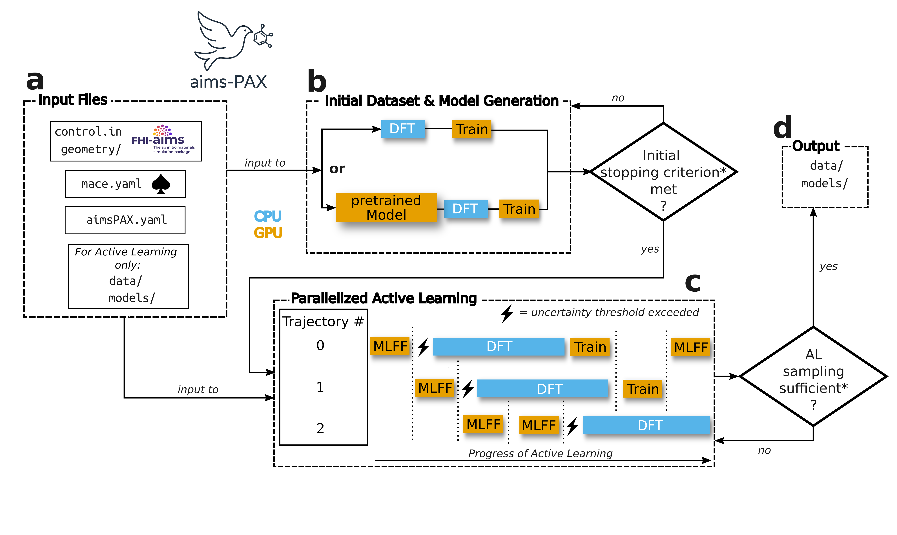

<!-- Light mode logo -->


<!-- Dark mode logo -->


*aims-PAX*, short for **a**b **i**nitio **m**olecular **s**imulation-**P**arallel **A**ctive e**X**ploration, is a flexible, fully automated, open-source software package for performing active learning for machine learning force fields using a parallelized algorithm that enables efficient resource management. 


# Documentation

**Note**: *aims-PAX* is under active development. Backward compatibility with older versions is not currently guaranteed.

## Installation 

### *aims-PAX*

To install *aims-PAX* and all its requirements do the following steps:
1. Create a(n) (mini)conda environment (if not existing already) e.g.: `conda create -n my_env python=3.10`
2. Activate the conda environment: `conda activate my_env`
3. Clone this repository
4. Move to the *aims-PAX* directory: `cd aims-PAX`
5. run the setup script: `bash setup.sh`

The latter will install the PARSL tools, other packages specified in `requirements.txt`, and *aims-PAX* itself.

### FHI aims

To install FHI aims you can follow the instruction in the [official manual](https://fhi-aims.org/uploads/documents/FHI-aims.250320_1.pdf).

Here is a quick rundown how to compile it on [Meluxina](https://docs.lxp.lu/):

1. Clone the source code from the FHI aims gitlab.
2. Move to the root FHI aims directory
3. Create a build directory and change to it: `mkdir build && cd build`
4. Create a `initial_cache.cmake` file with all necessary flags (an example is provided under:  `fhi_aims_help/example_initial_cache.cmake`)
5. Load necessary modules e.g. intel compilers etc.
6. run `cmake -C initial_cache.cmake ..`
7. run `make -j x` (x being the number of processes)

After compilation you will find an exectuable e.g. `aims.XXX.scalapack.mpi.x` which can then be used in *aims-PAX*.

A `.cmake` file for [Meluxina](https://docs.lxp.lu/) can be found in `fhi_aims_help`, alongside a script to run the compilation (step 7 above). The latter also includes the necessary modules that have to be loaded at step 5 above.

## Running 

To run *aims-PAX*, one has to specify the settings for FHI aims, the MACE model and active learning. 

1. make sure the following files are in the working directory:
    - ```control.in```, 
    - ```mace.yaml```,
    - ```aimsPAX.yaml```
    - either specify a geometry as `geometry.in` or provide a path in the `MISC` settings under `path_to_geometry`. For the latter, you can also specify a path to folder containing multiple geometry files (see Multi-system sampling).
2. run ```aims-PAX ``` in the directory

The settings are explained below and *aims-PAX* automatically runs the all necessary steps. During the run you can observe its progress in the `initial_dataset.log`and `active_learning.log` inside the log directory (default is `./logs`). At the end, the model(s) and data can be found in the `results/` folder.

Take a look at the example and its explanation (`example/explanation.md`) for more details.

**Note:** The models are named like this: `{name_exp}_{seed}.model` where `name_exp` is set in `mace.yaml` (see Settings/MACE settings section below)

Both procedures, initial dataset acquisition and active learning, are classes that can be used independently from each other. To only create an initial dataset you can run ```aims-PAX-initial-ds ```. Equivalently, to only run the active learning procedure (given that the previous step has been done or all the necessary files are present), just run ```aims-PAX-al```.

**Note:** you can also change the names of the settings file and run `aims-PAX --mace_settings path/to/my_mace.yaml --aimsPAX-settings path/to/my_aimspax.yaml` for example.

### Common Pitfalls

1. **Not specifying all required settings:** Take a look at the settings below. Mandatory ones are marked by *.
2. **Not properly specifying slurm settings in `CLUSTER` settings:** PARSL launches independent jobs from the main process, which collects the jobs' results. This means that these jobs need all the infos and settings that a normal job on an HPC enviroment also needs. In practice, you have to make sure that all the necessary `slurm` variables are provided under `slurm_str`. Setting of environment variables, loading modules as well as sourcing the correct conda environment has to be specified under `worker_str`. You can find an example in the `example` folder.

### Multi-system sampling

One of the major strengths of *aims-PAX* is running multiple trajectories at once to sample new points during active learning. It is possible to have multiple distinct geometries or chemical species in these different trajectories. For example, perhaps you want to start sampling for the same systems from various starting geometries or train a model different molecules, materials etc. at the same time. 

To do so, as mentioned in the **Running** section above, you must provide the path to a folder containing [`ASE` readable files](https://ase-lib.org/ase/io/io.html) under `path_to_geometry` under the `MISC` settings in the `aimsPAX.yaml` file.

*aims-PAX* then automatically reads all `ASE` readable files inside that directory and assigns it to a trajectory. If `num_trajectories` is smaller than the number of geometries present in the folder, *aims-PAX* will warn you and adjust `num_trajectories` to the number of actual geometries. If `num_trajectories` is larger than the number of geometries, *aims-PAX* will loop through the geometries again, assigning them to new trajectories until `num_trajectories` is satisfied.

If you want to use varying numbers of trajectories for each geometry you provide, the simplest solution for now is to duplicate each geometry file in the specified directory as many times as the number of trajectories you wish to run for that geometry.

During the **initial dataset generation**, at each step `(n_points_per_sampling_step_idg *times* ensemble_size *times* number of geometries)` will be sampled so that points are sampled for each geometry. 

During **active learning**, the uncertainty threshold is shared across all geometries, at the moment.

### Restarting

By default `create_restart` is set to `True` in `MISC` in the settings (see below). In that case, the state of the initial dataset generation or active learning run is frequently saved to a `.npy` file inside the `restart` directory. The procedure can be continued by just running `aims-PAX(-al/initial-ds)` again.

## Settings 

Description of all settings and their default values for FHI aims, *aims-PAX*, and MACE. First mandatory keywords are given and then they're sorted alphabetically.

### FHI aims settings (control.in)

The settings here are the same as for usual FHI aims calculations (see the official FHI aims [manual](https://fhi-aims.org/uploads/documents/FHI-aims.250320_1.pdf)) and are 
parsed internally in *aims-PAX*. MD settings are not specified here.

As we are using ASE/ASI for running FHI aims, it is not needed to add the basis set information at the ned of the ```control.in``` file. That information is taken straight from the indicated species directory (see ```species_dir``` in the settings).

### *aims-PAX* (aimsPAX.yaml)

Settings are given in a `.yaml` file. The file itself is split into multiple dictionaries: `INITIAL_DATASET_GENERATION`, `ACTIVE_LEARNING`, `MD`, `MISC`, `CLUSTER`.

Mandatory settings are indicated by \*. Otherwise, they are optional and default settings are used if not specified differently.

Example settings can be found in the `examples` folder.

#### INITIAL_DATASET_GENERATION:

| Parameter                       | Type             | Default           | Description                                                                                     |
| ------------------------------- | ---------------- | ----------------- | ----------------------------------------------------------------------------------------------- |
| \*species\_dir                | `str`            | —                 | Path to the directory containing the FHI AIMS species defaults.                                 |
| \*n_points_per_sampling_step_idg           | `int`            | —                 |  Number of points that is sampled at each step for each model in the ensemble and each geometry.                   |
| analysis | `bool` | `False` | Saves metrics such as losses during initial dataset generation.|
| desired_acc | `float` | `0.0` | Force MAE that the ensemble should reach on the validation set. Needs to be combined with `desired_acc_scale_idg`.|
| desired_acc_scale_idg | `float` | `10.0` | Scales `desired_acc` during initial dataset generation. Resulting product is accuracy that the model has to reach on the validation set before stopping the procedure at this stage. |
| ensemble_size | `int` | `4` | Number of models in the ensemble for uncertainty estimation. |
| foundational_model | `str` | `mace-mp` | Which foundational model to use for structure generation. Possible options: `mace-mp` or `so3lr`. |
| initial_foundational_size | `str` | `"small"` | Size of the foundational model used when `initial_sampling` is set to `mace-mp0`. |
| foundational_model_settings | `dict` | `{mace_model: small}` | Settings for the chosen foundational model for structure generation. |
| mace_model | `str` | `small` | Type of `MACE` foundational model. See [here](https://github.com/ACEsuit/mace/blob/main/mace/calculators/foundations_models.py) for their names. |
|  dispersion_lr_damping | `str` | `None` | Damping parameter for dispersion interaction in `SO3LR`. Needed if `r_max_lr` is not `None`!  Part of `foundational_model_settings`.|
| r_max_lr | `float` | `None` | Cutoff of long-range modules of `SO3LR`. Part of `foundational_model_settings`. |
| intermediate_epochs_idg | `int` | `5` | Number of intermediate epochs between dataset growth steps in initial training. |
| max_initial_epochs | `int` or `float` | `np.inf` | Maximum number of epochs for the initial training stage. |
| max_initial_set_size | `int` or `float` | `np.inf` | Maximum size of the initial training dataset. |
| progress_dft_update | `int` | `10` | Intervals at which progress of DFT calculations is logged.|
| scheduler_initial | `bool` | `True` | Whether to use a learning rate scheduler during initial training. |
| skip_step_initial | `int` | `25` | Intervals at which a structure is taken from the MD simulation either for the dataset in case of AIMD or for DFT in case of using an MLFF. |
| valid_ratio | `float` | `0.1` | Fraction of data reserved for validation. |
| valid_skip | `int` | `1` | Number of training steps between validation runs in initial training. |


##### Convergence 

After the initial dataset generation is finished *aims PAX* does not converge the model(s) on the final dataset by default. In case you want to do this the following keywords are relevant.
| Parameter                       | Type             | Default           | Description                                                                                     |
| ------------------------------- | ---------------- | ----------------- | ----------------------------------------------------------------------------------------------- |
| converge_initial | `bool` | `False` | Whether to converge the model(s) on the initial training set after a stopping criterion was met. |
| convergence_patience | `int` | `50` | Number of epochs without improvement before halting convergence. |
| margin | `float` | `0.002` | Margin to decide if a model has improved over the previous training epoch. |
| max_convergence_epochs | `int` | `500` | Maximum total epochs allowed before halting convergence |

<!---
| aims_lib_path | `str` or `None` | `None` | Path to the compiled FHI-aims library for direct force and energy evaluation. |
-->

#### ACTIVE_LEARNING:

| Parameter                       | Type             | Default           | Description                                                                                     |
| ------------------------------- | ---------------- | ----------------- | ----------------------------------------------------------------------------------------------- |
| \*species\_dir                | `str`            | —                 | Path to the directory containing the FHI AIMS species defaults.                                 |
| \*num\_trajectories           | `int`            | —                 | How many trajectories are sampled from during the active learning phase.                        |
| analysis                    | `bool`           | `False`           | Whether to run DFT calculations at specified intervals and save predicitions, uncertainties etc.                     |
| analysis\_skip              | `int`            | `50`              | Interval (in MD steps) at which analysis DFT calculations are performed.                     |
| c\_x                        | `float`          | `0.0`             | Weighting factor for the uncertainty threshold (see Eq. 2 in the paper). < 0 tightens, > 0 relaxes the threshold           |
| desired\_acc                | `float`          | `0.`                 | Force MAE (eV/Å) that the ensemble should reach on the validation set.                                 |
| ensemble\_size              | `int`            | `4`               | Number of models in the ensemble for uncertainty estimation.                                    |
| epochs\_per\_worker         | `int`            | `2`               | Number of training epochs per worker after DFT is done.                         |
| freeze\_threshold\_dataset  | `float`          | `np.inf`          | Training set size at which the uncertainty threshold is frozen; `np.inf` disables freezing.                     |
| intermediate\_epochs\_al    | `int`            | `1`               | Number of intermediate training epochs after DFT is done.       |
| margin                      | `float`          | `0.002`           | Margin to decide if a model has improved over the previous training epoch.                               |
| max\_MD\_steps              | `int`            | `np.inf`                 | Maximum number of steps taken using the MLFF during active learning per trajectory.             |
| max\_train\_set\_size       | `int`            | `np.inf`                 | Maximum size of training set before procedure is stopped.                                       |
| seeds\_tags\_dict           | `dict` or `None` | `None`            | Optional mapping of seed indices to trajectory tags for reproducible runs.                      |
| skip\_step\_mlff            | `int`            | `25`              | Step interval for evaluating the uncertainty criterion during MD in active learning.                   |
| uncertainty\_type           | `str`            | `"max_atomic_sd"` | Method for estimating prediction uncertainty. Default is max force standard deviation (See Eq. 1 in the paper).                                                   |
| uncert\_not\_crossed\_limit | `int`            | `50000`             | Max consecutive steps without crossing uncertainty threshold after which the a point is treated as if it crossed the threshold. This is done in case the models are overly confident for a long time.          |
| valid\_ratio                | `float`          | `0.1`             | Fraction of data reserved for validation during active learning.                                                       |
| valid\_skip                 | `int`            | `1`               | Rate at which validation of model during training is performed.                                               |

##### Convergence 

After the active learning is finished *aims PAX* converges the model(s) on the final dataset by default. The following keywords are only applied to this part.

| Parameter                       | Type             | Default           | Description                                                                                     |
| ------------------------------- | ---------------- | ----------------- | ----------------------------------------------------------------------------------------------- |
| converge\_al                | `bool`           | `True`            | Whether to converge the model(s) on the final training set at the end of active learning.                                 |
| converge\_best              | `bool`           | `True`            | Whether to only converge the best performing model of the ensemble.      |
| convergence\_patience       | `int`            | `50`              | Number of epochs without improvement before halting convergence.                             |
| max\_convergence\_epochs    | `int`            | `500`             | Maximum total epochs allowed before halting convergence.                            |


<!---
THESE ARE NOT ACTIVELY USED IN *aims-PAX* BUT ARE WORKING
| aims\_lib\_path             | `str` or `None`  | `None`            | Path to the compiled FHI-aims library for direct force and energy evaluation.                   |
| parallel                    | `bool`           | `False`           | Whether to run multiple active learning trajectories in parallel.                               |
| intermol\_crossed\_limit    | `int`            | `10`              | Max uncertainty threshold crossings allowed for intermolecular interactions before stopping.    |
| intermol\_forces\_weight    | `float`          | `100`             | Weight factor applied to intermolecular force contributions in the loss.                        |
-->

#### CLUSTER:

Settings for PARSL.

| Parameter | Type | Default | Description |
|-----------|------|---------|-------------|
| type | `str` | `'slurm'` | Cluster backend type. Currently only `slurm` is available. |
| \*project_name | `str` | — | Name of the PARSL run. |
| \*parsl_options | `dict` | — | Parsl configuration options. |
| &nbsp;&nbsp;&nbsp;&nbsp;&nbsp;\*nodes_per_block | `int` | — | Number of nodes per block. |
| &nbsp;&nbsp;&nbsp;&nbsp;&nbsp;\*init_blocks | `int` | — | Initial number of blocks to launch. |
| &nbsp;&nbsp;&nbsp;&nbsp;&nbsp;\*min_blocks | `int` | — | Minimum number of blocks allowed. |
| &nbsp;&nbsp;&nbsp;&nbsp;&nbsp;\*max_blocks | `int` | — | Maximum number of blocks allowed. |
| &nbsp;&nbsp;&nbsp;&nbsp;&nbsp;\*label | `str` | —| Unique label for this Parsl configuration. IMPORTANT: If you run multiple instances of aims-PAX on the same machine make sure that the labels are unique for each instance!|
| &nbsp;&nbsp;&nbsp;&nbsp;&nbsp;run_dir | `str` | `None` | Directory to store runtime files. |
| &nbsp;&nbsp;&nbsp;&nbsp;&nbsp;function_dir | `str`| `None` | Directory for Parsl function storage. |
| \*slurm_str | `str` (multiline) | — | SLURM job script header specifying job resources and options. |
| \*worker_str | `str` (multiline) | — | Shell commands to configure the environment for each worker process e.g. loading modules, activating conda environment. IMPORTANT: On most systems it's necessary to set the following environment variable so that multiple jobs don't interfere with each other: `export WORK_QUEUE_DISABLE_SHARED_PORT=1`. |
| \*launch_str | `str` | — | Command to run FHI aims e.g. `"srun path/to/aims/aims.XXX.scalapack.mpi.x >> aims.out"` |
| \*calc_dir | `str` | — | Path to the directory used for calculation outputs. |
| clean_dirs | `bool` | `True` | Whether to remove calculation directories after DFT computations. |

#### MD:
This part defines the settings for the molecular dynamics simulations during initial dataset generation and/or active learning. If only one set of settings is given, they are used for all systems/geometries. In case you want to use different settings for different systems or geometries you have specifiy which trajectory/system uses which system using their indices. Practically this means using a nested dictionary in the settings file:

```
MD:
  0:
    stat_ensemble: nvt
    thermostat: langevin
    temperature: 500
  1:    
    stat_ensemble: nvt
    thermostat: langevin
    temperature: 300
```
Here `0` and `1` refer to the indices used for giving the paths to the geometries and/or control files (see `MISC` settings below).

Currently these settings are used for *ab initio* and MLFF MD.

| Parameter | Type | Default | Description |
|-----------|------|---------|-------------|
| \*stat_ensemble | `str` | — | Statistical ensemble for molecular dynamics (e.g., `NVT`, `NPT`). |
| barostat | `str` | `MTK`| Barostat used when `NPT` is chosen. Stands for Full [Martyna-Tobias-Klein barostat](https://doi.org/10.1063/1.467468).|
| friction | `float` | `0.001` | Friction coefficient for Langevin dynamics (in fs<sup>-1</sup>). |
| MD_seed | `int` | `42` | Random number generator seed for Langevin dynamics. |
| pchain | `int` | `3` | Number of thermostats in the barostat chain for MTK dynamics. |
| pdamp | `float` | `500` | Pressure damping for MTK dynamics (`1000*timestep`). |
| ploop | `int` | `1` | Number of loops for barostat integration in MTK dynamics. |
| pressure | `float` | `101325.`| Pressure used for `NPT` in bar |
| tchain | `int` | `3` | Number of thermostats in the thermostat chain for MTK dynamics. |
| tdamp | `float` | `50` | Temperature damping for MTK dynamics (`100*timestep`). |
| temperature | `float` | `300`| Target temperature  |
| thermostat | `str` | `Langevin` | Thermostat used when `NVT` is chosen. |
| timestep | `float` | 0.5 | Time step for molecular dynamics (in femtoseconds). |
| tloop | `int` | `1` | Number of loops for thermostat integration in MTK dynamics. |


#### MISC:

The source of the geometries can be either a single path, a folder (where all `ASE` readable files will be loaded) or a dictionary of paths like:
```
  path_to_geometry:
    0: "path/geo1.in"
    1: "path/geo2.in"
```
Similarly, the source of the control files can be either a single path or a dictionary of paths like:
```
  path_to_control:
    0: "path/control1.in"
    1: "path/control2.in"
```
**Note:** Ideally you don't want to train your model on different levels of theory or DFT settings. Using different control files is mostly intended for using *aims-PAX* on periodic and non-periodic systems simulatenoeusly. Then you can specify that a k grid can be used for the periodic structure but not for the non-periodic one!

| Parameter       | Type          | Default     | Description                                          |
|-----------------|---------------|-------------|------------------------------------------------------|
| create_restart | `bool`       | `True`       | Whether to create restart files during the run.     |
| dataset_dir   | `str`        | `"./data"`    | Directory where dataset files will be stored.            |
| log_dir       | `str`        | `"./logs"`    | Directory where log files are saved.                 |
| path_to_control | `str`       | `"./control.in"` | Path to the FHI aims control input file.                      |
| path_to_geometry | `str`      | `"./geometry.in"` | Path to the geometry input file or folder.                     |


<!---
| **mol_idxs       | `list` or `None` | `None`   | List of molecule indices to consider; `None` means all. |
-->

### MACE settings (mace.yaml)

The settings for the MACE model(s) are specified in the YAML file called 'mace.yaml'.
We use exactly the same names as employed in the [MACE code](https://github.com/ACEsuit/mace). This is mostly to show the structure of the `.yaml` file and its default values.

#### GENERAL

| Parameter       | Type          | Default     | Description                                          |
|-----------------|---------------|-------------|------------------------------------------------------|
| name_exp    | `str`         | -           | This is the name given to the experiment and subsequently to the models and datasets. |
| checkpoints_dir | `str`         | `"./checkpoints"` | Directory path for storing model checkpoints. |
| compute_stress  | `bool`        | `False`       | Whether to compute stress tensors. |
| default_dtype   | `str`         | `"float32"`   | Default data type for model parameters (float32/float64). |
| loss_dir     | `str`         | `"./losses"`  | Directory path for storing training losses for each ensemble member. |
| model_dir       | `str`         | `"./model"`   | Directory path for storing final trained models. |
| seed            | `int`         | `42`          | Random seed (ensemble seeds are randomly chosen using this seed here.) |

#### ARCHITECTURE

| Parameter       | Type          | Default     | Description                                          |
|-----------------|---------------|-------------|------------------------------------------------------|
| atomic_energies | `dict` or `None` | `None `    | Atomic energy references for each element. Dictionary is structured as follows: {atomic_number: energy}. If `None`, atomic energies are determined using the training set using linear least squares. |
| compute_avg_num_neighbors | `bool` | `True`      | Whether to compute average number of neighbors. |
| correlation     | `int`         | `3`           | Correlation order for many-body interactions. |
| gate            | `str`         | `"silu"`      | Activation function. |
| interaction     | `str`         | `"RealAgnosticResidualInteractionBlock"` | Type of interaction block. |
| interaction_first| `str`        | `"RealAgnosticResidualInteractionBlock"` | Type of first interaction block. |
| max_ell         | `int`         | `3`           | Maximum degree of direction embeddings. |
| max_L           | `int`         | `1`           | Maximum degree for equivariant features. |
| MLP_irreps      | `str`         | `"16x0e"` | Irreps of the multi-layer perceptron in the last readout. Format is a `str` as defined in [`e3nn`](https://github.com/e3nn/e3nn/) |
| model           | `str`         | `"ScaleShiftMACE"` | Type of MACE model architecture to use. |
| num_channels    | `int`         | `128`         | Number of channels (features). |
| num_cutoff_basis| `int`         | `5`           | Number of cutoff basis functions. |
| num_interactions| `int`         | `2`           | Number of interaction layers. |
| num_radial_basis| `int`         | `8`           | Number of radial basis functions. |
| r_max           | `float`       | `5.0`         | Cutoff radius (Å). |
| radial_MLP      | `list`        | `[64, 64, 64]` | Architecture of the radial MLP (hidden layer sizes). |
| radial_type     | `str`         | `"bessel"`    | Type of radial basis functions. |
| scaling         | `str`         | `"rms_forces_scaling"` | Scaling method used. |


#### TRAINING

| Parameter       | Type          | Default     | Description                                          |
|-----------------|---------------|-------------|------------------------------------------------------|
| amsgrad         | `bool`        | `True`        | Whether to use AMSGrad variant of Adam optimizer. |
| batch_size      | `int`         | `5`           | Batch size for training data. |
| clip_grad       | `float`       | `10.0`        | Gradient clipping threshold. |
| config_type_weights | `dict`    | `{"Default": 1.0}` | Weights for different configuration types. |
| ema             | `bool`        | `True`        | Whether to use Exponential Moving Average. |
| ema_decay       | `float`       | `0.99`        | Decay factor for exponential moving average. |
| energy_weight   | `float`       | `1.0`         | Weight for energy loss component. |
| forces_weight   | `float`       | `1000.0`      | Weight for forces loss component. |
| loss            | `str`         | `"weighted"`  | Loss function type. |
| lr              | `float`       | `0.01`        | Initial learning rate for optimizer. |
| lr_factor       | `float`       | `0.8`         | Factor by which learning rate is reduced. |
| lr_scheduler_gamma | `float`    | `0.9993`      | Learning rate decay factor for scheduler. |
| optimizer       | `str`         | `"adam"`      | Optimizer type (adam/adamw). |
| scheduler       | `str`         | `"ReduceLROnPlateau"` | Learning rate scheduler type. |
| scheduler_patience | `int`      | `5`           | Number of epochs to wait before reducing LR. |
| stress_weight   | `float`       | `1.0`         | Weight for stress loss component. |
| swa             | `bool`        | `False`       | Whether to use Stochastic Weight Averaging. |
| valid_batch_size| `int`         | `5`           | Batch size for validation data. |
| virials_weight  | `float`       | `1.0`         | Weight for virials loss component. |
| weight_decay    | `float`       | `5.e-07`      | L2 regularization weight decay factor. |


#### MISC

| Parameter       | Type          | Default     | Description                                          |
|-----------------|---------------|-------------|------------------------------------------------------|
| device          | `str`         | `"cpu"`       | Device for training (cpu/cuda). |
| error_table     | `str`         | `"PerAtomMAE"` | Type of error metrics to compute and display. |
| log_level       | `str`         | `"INFO"`      | Logging level (DEBUG/INFO/WARNING/ERROR). |

<!---
| keep_checkpoints| `bool`        | `False`       | Whether to keep all checkpoint files. |
| restart_latest  | `bool`        | `False`       | Whether to restart from the latest checkpoint. |
-->


## The workflow 


Please consult the [publication](https://arxiv.org/abs/2508.12888) for a description of the *aims-PAX* workflow.

<!---

The overall workflow of the procedure and some comments thereupon are written here. For more details on specific parameters take a look at the settings glossary at the bottom.

Creating the initial ensemble and dataset.

In the beginning a set of MACE models is trained on a initial dataset to serve as a starting point for the actual active learning. Each ensemble member gets their own initial training and validation set. See a) in the figure above.

For that, *ab initio* MD is run (one trajectory) using FHI AIMS and ASI/ASE. Alternatively, the *"foundational"* model MACE-MP0 is used to sample structures, which are subsequently recomputed using DFT. This is recommended as one ideally wants to have uncorrelated structures and MACE-MP0 is much cheaper to evaluate and gives reasonable structures. Also, when using PARSL, the calculations can be processed in parallel.
 
After a set number of samples  is collected the models are trained. Afterwards, new points are sampled and this loop is repeated until a desired level of accurcay (or a different criterion like max number of epochs etc.) of the ensemble on the validation datasets is reached.

The model parameters are kept and updated throughout, so they are not reinitialized when new points are added.

Optionally, the model(s) can be converged on the dataset. This means that the models are trained on the initial dataset until there is no improvement anymore. 


Active Learning

During the active learning procedure (c in the figure above), multiple MD trajectories are launched and run with the MLFF model(s). At a specified interval the uncertainty of the forces are computed. After a warmup (currently 10 uncertainty estimations) the moving average of the uncertainties is calculated. Using this the uncertainty threshold (with c~x) is computed. If the threshold is crossed during MD the DFT energies and forces are calculated for that point. The point is then added to the training or validation set.  

In the former case the MD is halted for the given trajectory and when the program loops back to it the models are trained for some epochs instead before continuing to the next trajectory. This state is kept until a maximum number of epochs is reached and the trajectory is propageted again.

In the serial version of *aims-PAX*, the whole workflow halts when a DFT calculation is being run. In contrast, using the MPI version on a single node, the other trajectories can be propagated. In that case, once all trajectories have crossed the uncertainty threshold, the workflow is halted again and all DFT calculations are processed sequentially. When using the recommended PARSL version, all these DFT calculations can be processed in parallel depending on the available resources.


Similarly to the creation of the initial dataset, the models are updated throughout the whole process and are not reinitialized. As we are only adding a few points at a time this can lead to models getting stuck on a local minimum. If this happens, the optimizer state is reinitialized, which is supposed to kick the model out of the local minimum.

If the ```analysis``` keyword is set to ```True```, points from the MLFF MD are taken at fixed intervals and re-computed using FHI AIMS. The results and other metrics are saved in a dictionary. This can be used to track how the uncertainty behaves etc. As this results in many more DFT calculations it is generally not recommended for production runs.
-->
<!---
Atomic Energies

```THIS IS NOT IMPLEMENTED PROPERLY, RIGHT NOW!!!```

It is recommended to use the isolated atomic energies of the elements in a given system as the *zero point* energy in MACE. This enables the model have the correct asymptotic behavior when dissocating molecules. The package includes a script that calculates the energies of all the elements found in a the ```geometry.in``` file. For this run ```aims_PAX-atomic-energies```. Make sure to have defined the path to aims, the species directory in the ```active_learning_settings.yaml``` and also that a ```control.in``` file is present. The results are saved in a log file. The energies can then be included in ```mace.yaml```.
-->

# References

If you are using *aims-PAX* cite the main publication: 

***aims-PAX*:**
```bibtex
@misc{https://doi.org/10.48550/arxiv.2508.12888,
  doi = {10.48550/ARXIV.2508.12888},
  url = {https://arxiv.org/abs/2508.12888},
  author = {Henkes,  Tobias and Sharma,  Shubham and Tkatchenko,  Alexandre and Rossi,  Mariana and Poltavskyi,  Igor},
  keywords = {Chemical Physics (physics.chem-ph),  FOS: Physical sciences,  FOS: Physical sciences},
  title = {aims-PAX: Parallel Active eXploration for the automated construction of Machine Learning Force Fields},
  publisher = {arXiv},
  year = {2025},
  copyright = {arXiv.org perpetual,  non-exclusive license}
}
```

[**FHI-aims**](https://fhi-aims.org/)**:**

```bibtex
@misc{aims-roadmap-2025,
      title={Roadmap on Advancements of the FHI-aims Software Package}, 
      author={FHI aims community},
      year={2025},
      eprint={2505.00125},
      archivePrefix={arXiv},
      primaryClass={cond-mat.mtrl-sci},
      url={https://arxiv.org/abs/2505.00125}, 
}
```


**MACE:**
```bibtex
@inproceedings{Batatia2022mace,
  title={{MACE}: Higher Order Equivariant Message Passing Neural Networks for Fast and Accurate Force Fields},
  author={Ilyes Batatia and David Peter Kovacs and Gregor N. C. Simm and Christoph Ortner and Gabor Csanyi},
  booktitle={Advances in Neural Information Processing Systems},
  editor={Alice H. Oh and Alekh Agarwal and Danielle Belgrave and Kyunghyun Cho},
  year={2022},
  url={https://openreview.net/forum?id=YPpSngE-ZU}
}

@misc{Batatia2022Design,
  title = {The Design Space of E(3)-Equivariant Atom-Centered Interatomic Potentials},
  author = {Batatia, Ilyes and Batzner, Simon and Kov{\'a}cs, D{\'a}vid P{\'e}ter and Musaelian, Albert and Simm, Gregor N. C. and Drautz, Ralf and Ortner, Christoph and Kozinsky, Boris and Cs{\'a}nyi, G{\'a}bor},
  year = {2022},
  number = {arXiv:2205.06643},
  eprint = {2205.06643},
  eprinttype = {arxiv},
  doi = {10.48550/arXiv.2205.06643},
  archiveprefix = {arXiv}
 }
```

**So3krates/SO3LR:**

If you are using [SO3LR](github.com/general-molecular-simulations/so3lr) please cite:
```bibtex
@article{kabylda2024molecular,
  title={Molecular Simulations with a Pretrained Neural Network and Universal Pairwise Force Fields},
  author={Kabylda, A. and Frank, J. T. and Dou, S. S. and Khabibrakhmanov, A. and Sandonas, L. M.
          and Unke, O. T. and Chmiela, S. and M{\"u}ller, K.R. and Tkatchenko, A.},
  journal={ChemRxiv},
  year={2024},
  doi={10.26434/chemrxiv-2024-bdfr0-v2}
}

@article{frank2024euclidean,
  title={A Euclidean transformer for fast and stable machine learned force fields},
  author={Frank, Thorben and Unke, Oliver and M{\"u}ller, Klaus-Robert and Chmiela, Stefan},
  journal={Nature Communications},
  volume={15},
  number={1},
  pages={6539},
  year={2024}
}
```


## Contact

If you have questions you can reach us at: tobias.henkes@uni.lu or igor.poltavskyi@uni.lu

For bugs or feature requests, please use [GitHub Issues](https://github.com/tohenkes/aims-PAX/issues).

## License

The *aims-PAX* code is published and distributed under the [MIT License](MIT.md).


